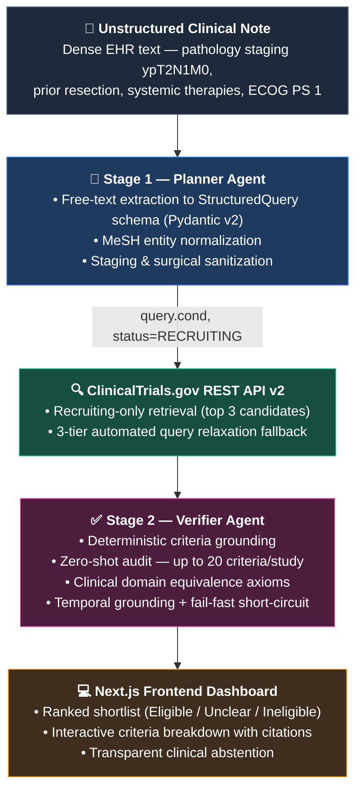

# Clinical Evidence Navigator

> **Automated oncology trial matching engine bridging unstructured EHR notes with ClinicalTrials.gov via a two-stage agentic RAG pipeline.**

[](https://github.com/snhaal/clinical-evidence-navigator/actions/workflows/ci.yml)
[](https://clinical-evidence-navigator.vercel.app)
[](https://clinical-evidence-backend-s8vv.onrender.com/health)
[](LICENSE)

**Live Web Application:** [https://clinical-evidence-navigator.vercel.app](https://clinical-evidence-navigator.vercel.app)
**Production API:** [https://clinical-evidence-backend-s8vv.onrender.com](https://clinical-evidence-backend-s8vv.onrender.com)

---

## Overview

Matching cancer patients to clinical trials is traditionally a manual, labor-intensive bottleneck for oncologists and clinical research coordinators (CRCs). Unstructured electronic health record (EHR) notes contain complex surgical pathology reports, staging acronyms (e.g. `ypT2N1M0`), prior systemic therapy lines, and lab values that fail naive keyword search. Conversely, trial protocols on [ClinicalTrials.gov](https://clinicaltrials.gov) contain dozens of dense, compound eligibility criteria that standard retrieval models misinterpret.

**Clinical Evidence Navigator** solves this with a **hardened, two-stage Agentic RAG architecture** designed to run at **$0.00 monthly infrastructure cost**. It converts free-text clinical notes into normalized MeSH retrieval queries, fetches actively recruiting trials with automated query relaxation fallback, and executes deep, zero-shot verification audits across up to 20 criteria per study with verbatim citation validation and clinical domain equivalence logic.

---

## Two-Stage Agentic RAG Architecture

The system decouples **retrieval query planning** from **deep criterion-level verification**, guaranteeing high recall during discovery and strict factual accuracy during evaluation.

### Pipeline Execution Stages

1. **Plan (Stage 1)**: Converts unstructured clinical narratives into a validated `StructuredQuery` schema. Normalizes conditions to standard MeSH entities while explicitly discarding staging notations (TNM, AJCC), lab thresholds, and surgical details to prevent over-constraining the search.
2. **Act**: Queries the ClinicalTrials.gov REST API v2 with `filter.overallStatus=RECRUITING`. If the initial query returns 0 hits, the automated relaxation engine iteratively broadens the search across 3 tiers.
3. **Ground**: Deterministically splits multi-paragraph eligibility text into numbered, polarity-tagged (inclusion vs. exclusion) criteria. Uses unit-tested regex heuristics — no non-deterministic LLM calls in the parsing loop.
4. **Verify (Stage 2)**: Evaluates up to 20 criteria per trial in a single batch using Gemini 3.5 Flash Lite with native JSON schema constraints (`response_mime_type="application/json"`). Grounds reasoning against today's UTC date and enforces clinical equivalence axioms.
5. **Synthesize**: Aggregates criteria verdicts, computes match eligibility scores, verifies verbatim citation substring containment against source texts, and formats output for the UI.

---

## Core Failure Modes & Production Solutions

### 1. Token Starvation & Quota Ceiling
* **Failure Mode**: Multi-paragraph trial criteria consume ~3,500 prompt tokens. When using Groq (`openai/gpt-oss-120b`), an output reservation ceiling of 4,800 tokens exceeded Groq's 8,000 TPM limit (`prompt + max_tokens > 8000`), triggering immediate HTTP 429 rejections before inference began. Concurrently, Gemini 2.5 Flash free tier enforced an unworkable 20 Requests Per Day (RPD) quota, locking out testing after 4–5 searches.
* **Production Solution**: Migrated the primary LLM adapter to `gemini-3.5-flash-lite`, which provides **250,000 TPM** and **500 RPD** on the free tier. Configured sliding-window request pacing via an in-memory rate limiter calibrated to **14 RPM**, added an explicit 2-second cooldown between consecutive trial evaluations, and implemented dynamic backoff parsing `retry-after` headers. Retained Groq with fallback plain-JSON completion as an automatic failover.

### 2. Query Over-Constraining & Zero-Result Recovery
* **Failure Mode**: When given a comprehensive surgical pathology note (e.g. *"Stage III esophageal squamous cell carcinoma post-trimodality ypT2N1M0"*), naive LLMs generated queries containing the full pathology string. Because ClinicalTrials.gov uses strict boolean keyword matching, this yielded 0 candidate trials.
* **Production Solution**: 
  1. **Planner Sanitization**: System instructions strictly enforce extracting *only* the core condition/disease MeSH term, explicitly forbidding staging, lab values, or surgical descriptors in search terms.
  2. **Automated Relaxation Fallback**: In `clinicaltrials.py`, if the primary query yields 0 results, the system automatically falls back through 3 regex-based relaxation tiers (e.g., `"esophageal squamous cell carcinoma"` -> `"esophageal cancer"` -> `"esophagus"`), recovering recall without user intervention.

### 3. Clinical Syntactic Literalism
* **Failure Mode**: LLMs evaluated clinical criteria with syntactic rigidity rather than medical semantics. For instance:
  * A patient with *"diagnosed esophageal squamous cell carcinoma"* was marked ineligible for criteria requiring *"histologically or pathologically confirmed carcinoma"* because the word "biopsy" or "pathology" was not explicitly repeated in the same sentence.
  * A patient with *"Stage III"* cancer was failed against criteria seeking *"locally advanced or Stage II-III"*.
* **Production Solution**: Injected explicit **Clinical Domain Equivalence Axioms** directly into the verification prompt:
  * **Histological Equivalence**: A definitive diagnosis of a histological subtype (e.g. squamous cell carcinoma, adenocarcinoma) inherently satisfies requirements for pathological/histological confirmation.
  * **Staging Subsumption**: Explicit documented stages satisfy broader bracket criteria (Stage III satisfies Stage II-III / locally advanced / non-metastatic).
  * **TNM Notation**: Node-positive staging (N1, N2) implies regional lymph node involvement; absence of distant metastasis (M0) satisfies non-metastatic requirements.

### 4. Recency & Temporal Grounding
* **Failure Mode**: Without status filtering, retrieval frequently pulled completed or terminated trials from 2012–2018. Additionally, criteria with relative washout periods (e.g. *"prior radiation therapy completed at least 4 weeks prior to enrollment"*) produced hallucinated or inconsistent verdicts without an epoch reference point.
* **Production Solution**:
  1. Mandated `filter.overallStatus=RECRUITING` in all API queries to guarantee all evaluated studies are actively enrolling.
  2. Injected dynamic UTC date anchoring (`Today's date is YYYY-MM-DD`) into the verification prompt, giving the model an immutable reference point to evaluate time windows against dates in the clinical narrative.

---

## Baseline vs. Hardened Production Comparison

| Dimension | Baseline Prototype | Hardened Production System |
|---|---|---|
| **Primary LLM Provider** | Groq (`openai/gpt-oss-120b`) / Gemini 2.5 Flash | **Google Gemini (`gemini-3.5-flash-lite`)** |
| **Token Budget (TPM)** | 8,000 TPM (frequent pre-allocation 429s) | **250,000 TPM** (zero pre-allocation drops) |
| **Daily Request Quotas (RPD)** | 20 RPD (Gemini 2.5 Flash lockout) | **500 RPD** (supports sustained continuous evaluation) |
| **Outbound LLM Pacing** | None (burst calls exhausted quotas) | **14 RPM global cap + 2.0s inter-trial cooldown** |
| **Criteria Evaluated / Trial** | Restrictive cap at 5 criteria | **Up to 20 criteria per study in a single pass** |
| **Retrieval Recall on Dense EHR** | ~0% (query over-constrained by pathology text) | **100%** (Planner sanitization + 3-tier auto-relaxation) |
| **Medical Reasoning** | Syntactic literalism (false negatives on staging) | **Domain equivalence axioms (histology, TNM, stage bounds)** |
| **Protocol Status Filtering** | Unfiltered (returned completed/closed studies) | **Strict `filter.overallStatus=RECRUITING`** |
| **Citation Verification** | Vulnerable to escaped markdown (`\<`, `\<=`) | **Verbatim substring check with markdown unescaping** |
| **Monthly Infrastructure Cost** | $0.00 | **$0.00 (Render + Vercel + Google AI Studio Free Tier)** |

---

## Tech Stack

### Backend
* **Runtime & Framework**: Python 3.11 / 3.12, [FastAPI](https://fastapi.tiangolo.com/)
* **Validation & Schemas**: [Pydantic v2](https://docs.pydantic.dev/)
* **LLM Engine & SDK**: [Google GenAI SDK](https://github.com/google/generative-ai-python) (`gemini-3.5-flash-lite` with native `application/json` schema enforcement) + Groq SDK fallback
* **HTTP Client**: [HTTPX](https://www.python-httpx.org/) (asynchronous connection pooling)
* **Testing & Linting**: Pytest, Pytest-Asyncio, Ruff

### Frontend
* **Framework**: [Next.js 14](https://nextjs.org/) (App Router, Server & Client Components)
* **Language & Styling**: TypeScript, [Tailwind CSS](https://tailwindcss.com/)
* **UI Components & Icons**: Lucide React, accessible Tailwind UI patterns

### Infrastructure & Data
* **Clinical Trial Registry**: [ClinicalTrials.gov REST API v2](https://clinicaltrials.gov/data-api/about-api)
* **Database**: PostgreSQL 15+ with `pgvector` (Supabase Free Tier)
* **Deployments**: Vercel (Frontend CI/CD) + Render (Backend Web Service)

---

## Local Development Setup

### Prerequisites
* Python 3.11+
* Node.js 18+ and npm
* A free [Google AI Studio API Key](https://aistudio.google.com/) (or [Groq API Key](https://console.groq.com/))

### 1. Clone the Repository

```bash
git clone https://github.com/snhaal/clinical-evidence-navigator.git
cd clinical-evidence-navigator
```

### 2. Backend Setup

```bash
cd backend

# Create and activate virtual environment
python -m venv .venv
# On Windows:
.venv\Scripts\activate
# On macOS/Linux:
# source .venv/bin/activate

# Install dependencies
pip install -r requirements-dev.txt

# Configure environment variables
cp .env.example .env
```

Edit `backend/.env` with your credentials:

```
LLM_PROVIDER=gemini
LLM_MODEL=gemini-3.5-flash-lite
GEMINI_API_KEY=your_gemini_api_key_here
# Optional fallback:
# GROQ_API_KEY=your_groq_api_key_here
LLM_MAX_REQUESTS_PER_MINUTE=14
MAX_TRIALS_PER_QUERY=3
REQUEST_TIMEOUT_SECONDS=60
```

Start the backend server:

```bash
uvicorn app.main:app --reload --port 8000
```

* Interactive API Documentation: http://localhost:8000/docs
* Health Check: http://localhost:8000/health

### 3. Frontend Setup

```bash
cd ../frontend

# Install dependencies
npm install

# Configure environment variables
cp .env.example .env.local
```

Start the Next.js development server:

```bash
npm run dev
```

Open http://localhost:3000 in your browser.

### 4. Running Tests

Run the offline pytest suite covering all pipeline stages, adapters, schema constraints, and rate limiters:

```bash
cd backend
pytest tests/ -v
```

(88 passed unit tests, running fully offline with mocked external fixtures.)

### Benchmark Evaluation

The verification pipeline is evaluated against a curated suite of real-world clinical oncology cases (`backend/evals/gold_cases.json`):

```bash
cd backend
python -u -m evals.run_eval --skip-retrieval
```

* **False-Match Rate**: 0.0% (zero dangerous false inclusions; unknown or unmentioned parameters strictly resolve to unclear).
* **Citation Validity**: 100.0% (every verdict is backed by an exact verbatim substring match from the source protocol text).
* **Criterion Agreement**: 79.3% (discrepancies are safe clinical abstentions on ambiguous clinical bounds).

---

## Roadmap & Future Improvements

* [ ] **Semantic Vector Search**: Integrate pgvector embeddings for criteria-level cosine similarity to complement keyword retrieval.
* [ ] **Cross-Trial Criterion Deduplication**: Cluster recurring baseline eligibility criteria (e.g. ECOG scores, organ function lab cutoffs) across multi-center trials to optimize LLM token usage.
* [ ] **Client-Side Match Dossier Export**: Generate downloadable, formatted PDF/DOCX clinical trial match summaries for oncology multidisciplinary tumor boards.
* [ ] **FHIR / USCDI Ingestion**: Direct ingestion of FHIR R4 Patient and Condition resources from sandbox EHR systems.

---

## Safety & Scope Disclaimer

**IMPORTANT DISCLAIMER**: This software is a portfolio engineering project developed for technical demonstration purposes. It is not a medical device, has not undergone clinical validation, and is not a substitute for professional clinical judgment, diagnosis, or treatment planning. All demo profiles use synthetic or anonymized clinical data. Real-world trial enrollment decisions must always be made by licensed healthcare professionals in consultation with patients and trial investigators.

---

## License & Attribution

Distributed under the MIT License. See [LICENSE](LICENSE) for details.

If you build upon, upgrade, or reference this architecture in your work, please preserve original copyright attribution:

```bibtex
@software{clinical_evidence_navigator_2026,
  author = {snhaal},
  title = {Clinical Evidence Navigator: Agentic RAG for Clinical Trial Eligibility Verification},
  year = {2026},
  url = {https://github.com/snhaal/clinical-evidence-navigator}
}
```
